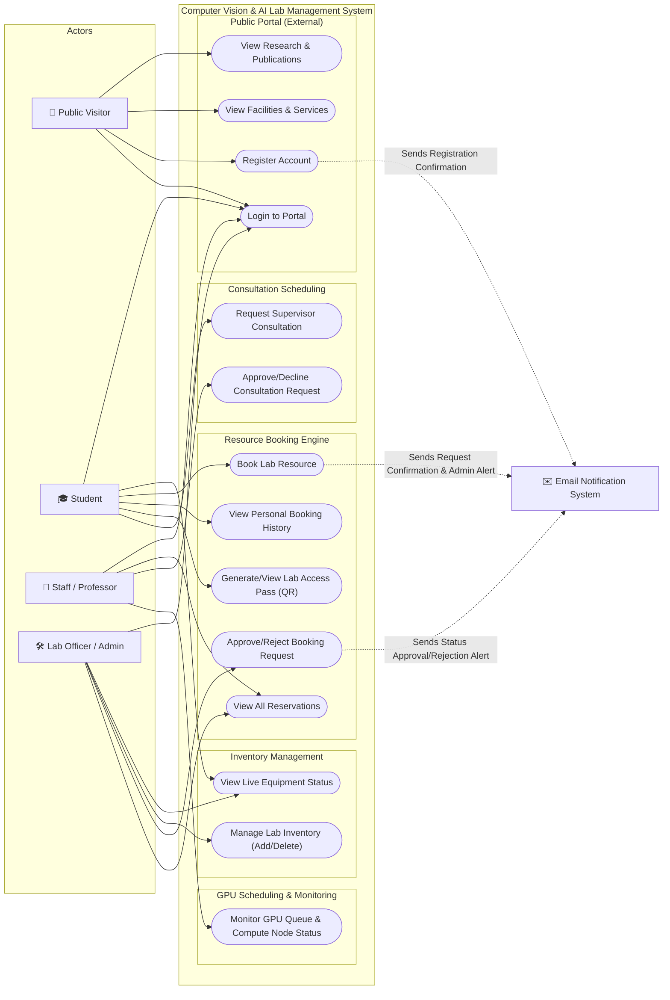

# Appendix A: Use Case Diagram

This appendix provides the Use Case Diagram and detailed descriptions of the actors and use cases for the **Computer Vision & AI Lab Management System**.

## Use Case Diagram

The following diagram outlines the interactions between the system's actors and the key functional modules (Public Portal, Resource Booking Engine, GPU Scheduling, Inventory Management, and Academic Consultations).

---

## System Actors

| Actor | Type | Description |
| :--- | :--- | :--- |
| **👤 Public Visitor** | Primary | An unauthenticated external user browsing the public-facing pages of the laboratory website. |
| **🎓 Student** | Primary | A registered lab student (BSc, MPhil, or PhD candidate) who uses the system to book lab equipment, schedule GPU compute tasks, and request supervisor consultations. |
| **🔬 Staff / Professor** | Primary | A lab supervisor, researcher, or the Lab Director who reviews academic consultations, monitors running GPU jobs, and views bookings. |
| **🛠️ Lab Officer / Admin** | Primary | The system administrator or designated lab officer responsible for managing inventory (adding/deleting items) and approving or rejecting resource bookings. |
| **✉️ Email Notification System** | Secondary | An external mail service integrated with the backend API to dispatch transactional notification alerts (e.g., registration confirmation, reservation approval/rejection) to users. |

---

## Detailed Use Case Descriptions

### 1. Public Portal (External)
*   **View Research & Publications**: Allows any visitor to browse research areas, active projects, publication listings, and news regarding lab activities.
*   **View Facilities & Services**: Displays information about available lab facilities (e.g., computing cluster, motion capture rig, drone fleets) and support services.
*   **Register Account**: Allows visitors to create a new profile (by default, registered accounts are assigned the `student` role).
*   **Login to Portal**: Authenticates registered users (Students, Staff, Officers) and redirects them to their respective role-based dashboard.

### 2. Resource Booking Engine
*   **Book Lab Resource**: Allows students to submit reservation requests for specific equipment or time slots.
*   **View Personal Booking History**: Lets students track the status and historical records of their booking requests.
*   **Generate/View Lab Access Pass (QR)**: Once a reservation is approved, a QR code access pass is generated for the student to scan at the lab entrance.
*   **Approve/Reject Booking Request**: Grants Lab Officers/Admins authorization to evaluate and approve or deny pending bookings.
*   **View All Reservations**: Allows Staff and Admins to inspect the complete registry of current and historic bookings.

### 3. Inventory Management
*   **View Live Equipment Status**: Allows logged-in users to view available and active hardware items in real-time.
*   **Manage Lab Inventory (Add/Delete)**: Allows authorized Lab Officers to register new equipment items or remove decommissioned items from the system database.

### 4. Consultation Scheduling
*   **Request Supervisor Consultation**: Allows students to schedule appointments with supervisors for CV methodology advice, publication reviews, or research guidance.
*   **Approve/Decline Consultation Request**: Allows Staff members to manage their incoming appointment requests from students.

### 5. GPU Scheduling & Monitoring
*   **Monitor GPU Queue & Compute Node Status**: Provides Staff and Students with a visual representation of active training jobs, active nodes (e.g., NVIDIA A100), and current utilization load statistics.
