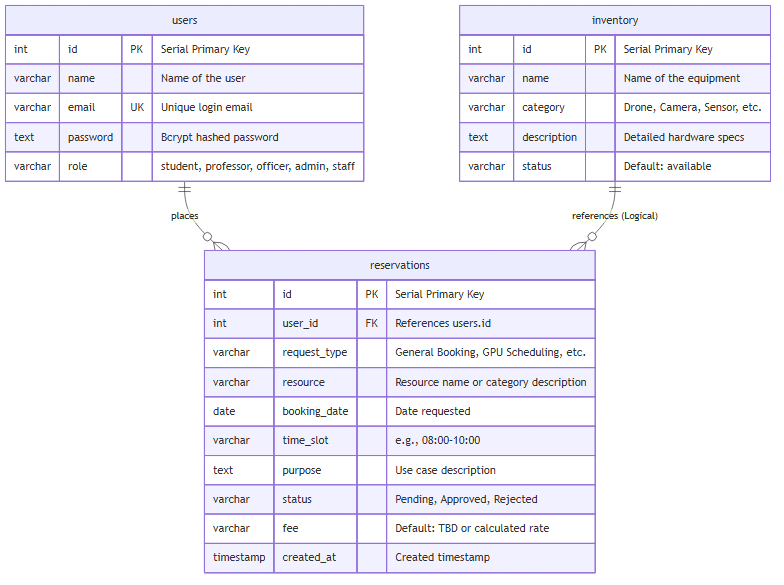
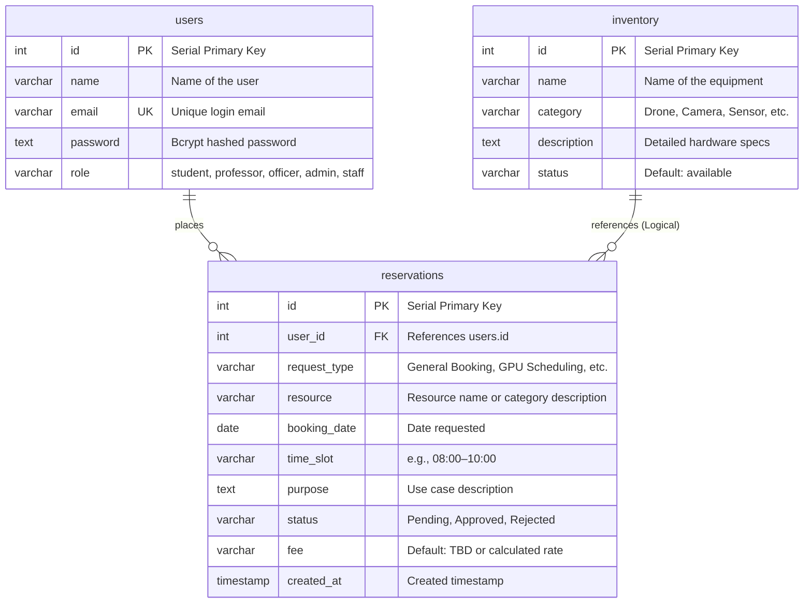

# Appendix B: Entity-Relationship (ER) Diagram

This appendix provides the Entity-Relationship (ER) Diagram and database schema specifications for the **Computer Vision & AI Lab Management System** database.

## Entity-Relationship Diagram

The diagram below details the physical database model (based on PostgreSQL) and illustrates the logical relationships between the core entities: `users`, `inventory`, and `reservations`.

<b>Click to expand Mermaid Source Code</b>

---

## Entity Mappings & Specifications

### 1. Users Entity (`users`)
Stores profile and credentials of all users interacting with the laboratory system.
*   `id`: Primary key (automatically incremented).
*   `name`: User's full name.
*   `email`: User's university email, enforced with a `UNIQUE` constraint. Used for logins and emails.
*   `password`: Secure Bcrypt password hash.
*   `role`: User permission level (`student`, `professor`, `officer`, `admin`, `staff`), validated via a check constraint.

### 2. Inventory Entity (`inventory`)
Tracks the laboratory's hardware, devices, and high-value compute resources.
*   `id`: Primary key (automatically incremented).
*   `name`: Label or model of the device (e.g., "DJI Matrice 300 RTK").
*   `category`: Classification (e.g., "Drone", "Camera", "Computing", "Sensor").
*   `description`: Description of item technical specs or characteristics.
*   `status`: Availability tracker (e.g., `available`, `borrowed`, `maintenance`).

### 3. Reservations Entity (`reservations`)
Registers all booked resources, time frames, and processing stages.
*   `id`: Primary key (automatically incremented).
*   `user_id`: Foreign key referencing `users.id` with `ON DELETE CASCADE` enabled.
*   `request_type`: Type of the booking request (e.g., General Booking, GPU Scheduling).
*   `resource`: Resource identifier (logically refers to a specific inventory item or a service).
*   `booking_date`: Requested reservation date.
*   `time_slot`: Targeted scheduling interval.
*   `purpose`: Context of usage.
*   `status`: Lifecycle stage (`Pending`, `Approved`, `Rejected`).
*   `fee`: Tracked cost of reservation (Default: "TBD").
*   `created_at`: The exact time the booking request was submitted.

---

## Relationship Integrity Rules

1.  **User to Reservation (One-to-Many)**:
    *   A user can place zero or many reservations.
    *   Each reservation is associated with exactly one user.
    *   Referential integrity is maintained by a foreign key constraint (`user_id REFERENCES users(id)`).
    *   `ON DELETE CASCADE` is set so that deleting a user profile automatically deletes all their related reservation histories.

2.  **Inventory to Reservation (Logical One-to-Many)**:
    *   The `reservations.resource` string maps logically to the `inventory.name` or category.
    *   This is kept as a loose logical connection rather than a strict database foreign key to allow flexible scheduling of virtual assets (such as "Lab Space Access" or "Consultation sessions") that are not registered in the hardware inventory table.
